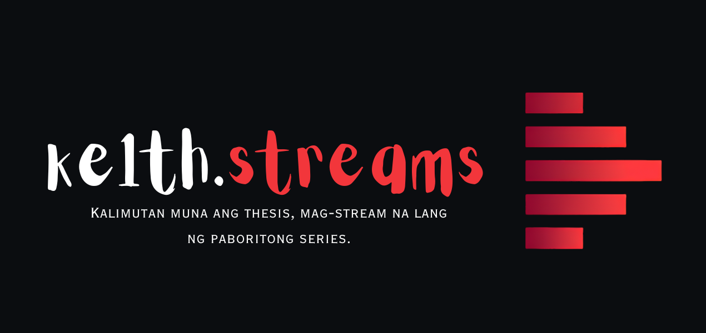

<div align="center">
  
  <h1>ke1th.streams</h1>
  <p>A sleek, high-performance streaming interface built with the TMDB API.</p>

  <a href="https://stream.ke1th.dev/"><strong>Live Demo</strong></a>

  <br><br>

  
  
  
  
  <br><br>
  
  
</div>

<br>

## Overview

**ke1th.streams** is a modern, highly responsive streaming UI inspired by premium platforms like Netflix and Disney+. It features a multi-server streaming player, dynamic content discovery via the TMDB API, and a polished aesthetic focused strictly on user experience.

**Safe & Secure By Design:** No files are stored on my servers—all media is linked securely from third-party sources. I do not collect personally identifiable information (PII). All user preferences (like "Watch Later" lists and "Watch Progress") are securely stored locally on your own device.

---

## Live

Experience the platform live at: **[stream.ke1th.dev](https://stream.ke1th.dev/)**

---

## Features

### Content Discovery
- **Dynamic Content Rails** – Smooth horizontal scrolling for Top 10 Today, Trending, Top Rated, and genre-based sections.
- **Platform Dropdowns** – Browse content exclusive to top streaming platforms (Netflix, Prime Video, Disney+, Max, Apple TV+, etc.) with official TMDB logos.
- **Hero Spotlights** – Auto-rotating cinematic hero banners with backdrop images and metadata.

### Media Detail Page
- **Background Trailer** – Auto-playing YouTube trailer in the hero section. Fully cropped to appear as a cinematic background with no visible YouTube branding.
- **Thumbs Up / Down Rating System** – Rate movies and shows securely. Powered by TMDB Guest Sessions, allowing users to submit ratings entirely anonymously without needing to create or link an account.
- **Cast Grid & Recommendations** – Browse actor cards and seamlessly discover "More Like This".

### Streaming Player
- **Multiple Server Sources** – High-quality streaming servers with a compact dropdown server selector.
- **Auto-Fallback** – Automatically switches to a backup source if a server fails.
- **Ad-Blocker Friendly** – All server ads are blockable with extensions like uBlock Origin or Brave browser. A built-in disclaimer guides users on secure setup.

### User Experience & Security
- **100% Local Storage** – Watch Progress, Search History, and Watch Later lists are tracked securely via `localStorage` on your own device. Your data never touches my servers.
- **Edge Proxy API Security** – All API requests to TMDB are routed securely through a custom Cloudflare Worker proxy, completely hiding the API key from the browser and protecting against scraping.
- **Anonymous Ratings** – The thumbs up/down system uses temporary TMDB guest sessions to protect your privacy.
- **Dark Mode Native** – Deep dark theme optimized for OLED displays with premium glassmorphism effects.

---

## Tech Stack

| Layer | Technology |
|-------|-----------|
| **Frontend** | HTML5, CSS3, Vanilla JavaScript (Zero frameworks) |
| **API Integration** | TMDB API (Metadata, Images, Videos, Providers, Guest Sessions) |
| **Media Delivery**| Third-party iframe embeds |
| **Data Persistence** | `localStorage` (Secure client-side storage) |
| **Hosting & CI/CD** | Cloudflare Pages integrated via GitHub |

---

## Setup Instructions

To run this project locally:

1. Clone the repository to your machine.
2. Open `assets/js/config.js`. You have two options for configuring the TMDB API:
   - **Option A (Quick Start):** Set `BASE_URL` to `https://api.themoviedb.org/3` and paste your TMDB API key into the `API_KEY` variable. *(Note: This exposes your key in the browser)*.
   - **Option B (Secure/Production):** Deploy a Cloudflare Worker as an API proxy. Set your `BASE_URL` to your proxy's URL and leave `API_KEY` empty. Inject the TMDB key securely as an environment variable in your Worker.
3. Open `index.html` in your browser or run a local development server.

```text
STREAMMOVIES/
  assets/
    css/        -- Stylesheets (home.css, media.css)
    js/         -- Application logic (home.js, media.js, tmdb.js, config.js)
    imgs/       -- Favicons and PWA assets
  index.html    -- Home page
  media.html    -- Media detail page
```

---

## Legal Disclaimer

**ke1th.streams** does not host, store, or upload any files on its servers. The application acts strictly as an indexing UI, linking to media hosted on external, third-party services over which I have no control. 

<br>

<div align="center">
  <sub>Built for speed. Designed for aesthetics. Secured for privacy.</sub>
</div>
